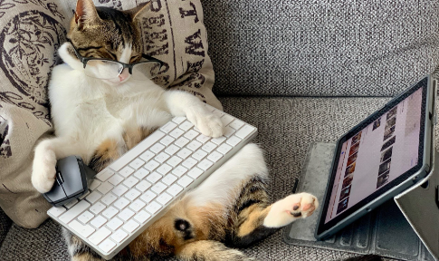

<!--
**SabihahAmirudeen/SabihahAmirudeen** is a ✨ _special_ ✨ repository because its `README.md` (this file) appears on your GitHub profile.

Here are some ideas to get you started:

- 🔭 I’m currently working on ...
- 🌱 I’m currently learning ...
- 👯 I’m looking to collaborate on ...
- 🤔 I’m looking for help with ...
- 💬 Ask me about ...
- 📫 How to reach me: ...
- 😄 Pronouns: ...
- ⚡ Fun fact: ...
-->

# 👋 Hi, I'm Sabihah!

🎓 Undergraduate Cybersecurity Major @ SiT  
🛡️ Passionate about Digital Forensics, AI in Cybersecurity, and Mobile Security!  
🔭 Exploring Andriod Studio and Flutter, Dart  
👯 WORK HARD,PLAY HARD KIDSS  
🚲 🏸 🥋 💻

## 📫 Let's Connect!
- https://www.linkedin.com/in/sabihah-amirudeen 
